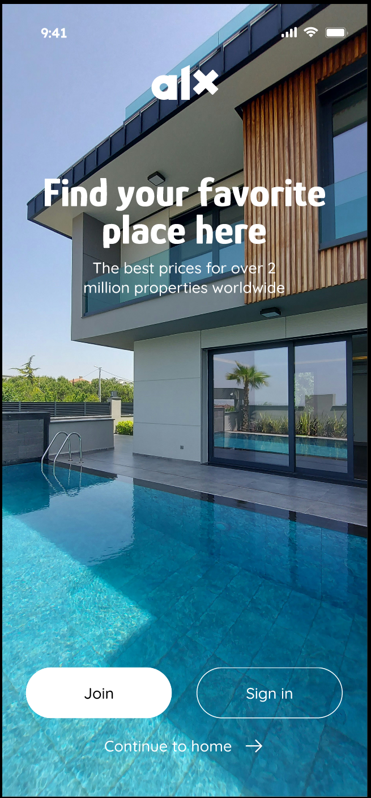

# prodev-mobile-app-0x02



## 📑 Table of Contents

- [Overview](#overview)
- [Objectives](#objectives)
- [Steps Followed](#steps-followed)
- [Implemented Features](#implemented-features)

---

## Overview

This task focuses on implementing **Safe Areas, Images, and Touchable Components** in a React Native Expo application.

The UI includes a full-screen background image, centered logo, styled text, and interactive buttons, all wrapped safely inside a `SafeAreaProvider` and `SafeAreaView`.

---

## Objectives

- Use `SafeAreaView` and `SafeAreaProvider` to prevent UI overlap with device notches.
- Add background images with `ImageBackground` and `Dimensions`.
- Display a centered company logo using `Image`.
- Style and arrange text groups.
- Add interactive buttons with `TouchableOpacity`.
- Provide a navigation prompt at the bottom of the screen.

---

## Steps Followed

1. **Initialize Project**

   ```bash
   npx create-expo-app@latest prodev-mobile-app-0x02
   ```

2. **Reset Template**

   ```bash
   cd prodev-mobile-app-0x02
   npm run reset-project
   ```

3. **Added Assets**

   - Moved `Logo.png` and `background-image.png` into:

     ```
     assets/images/
     ```

4. **Updated `app/index.tsx`**

   - Wrapped app in `SafeAreaProvider` and `SafeAreaView`.
   - Added background image covering full screen.
   - Inserted company logo at center.
   - Added styled text group.
   - Created button group with `Join here` and `Sign In` buttons.
   - Added navigation prompt at bottom.

---

## Implemented Features

- ✅ **Safe Area Support** using `react-native-safe-area-context`
- ✅ **Full-Screen Background** with `ImageBackground` and `Dimensions`
- ✅ **Company Logo** centered on the screen
- ✅ **Text Group** with large and small styled text
- ✅ **Buttons** using `TouchableOpacity`
- ✅ **Bottom Navigation Prompt**
