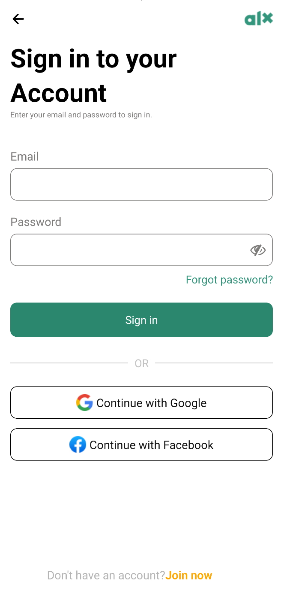

# prodev-mobile-app-0x03



## 📚 Table of Contents

- [Objective](#objective)
- [Project Setup](#project-setup)
- [Implemented Features](#implemented-features)
- [Screenshots](#screenshots)
- [Observations](#observations)

---

## Objective

The goal of this task is to **explore React Native core components** such as `Text`, `TextInput`, `View`, `TouchableOpacity`, `Image`, along with safe area handling and vector icons.

This builds a functional **login screen** with styled input fields, buttons, and social media sign-in options.

---

## Project Setup

1. Created project:

   ```bash
   npx create-expo-app@latest prodev-mobile-app-0x03
   cd prodev-mobile-app-0x03
   ```

2. Reset template:

   ```bash
   npm run reset-project
   ```

3. Added assets (`logo.png`, `google.png`, `facebook.png`) into:

   ```
   assets/images/
   ```

4. Created global styles in:

   ```
   styles/index.tsx
   ```

5. Modified `app/index.tsx` to implement login screen UI.

---

## Implemented Features

- **Safe areas** with `SafeAreaProvider` + `SafeAreaView` to avoid notches.
- **Navigation group** with back arrow (`Ionicons`) and app logo.
- **Form inputs** for email and password with placeholder labels.
- **Password field** includes `FontAwesome eye-slash` icon.
- **Primary Sign in button** styled with custom styles.
- **Divider section** with `"OR"` for alternative sign-in methods.
- **Social login buttons** (Google and Facebook) with logos + text.
- **Subtext navigation** with “Don’t have an account? Join now”.

---

## Observations

- Using `SafeAreaView` ensures UI doesn’t overlap with device status bars or notches.
- `TextInput` styling requires padding and border tweaks for a clean look.
- Social media buttons benefit from **flex row layout** with `gap`.
- Splitting styles into `styles/index.tsx` makes the app more maintainable.
